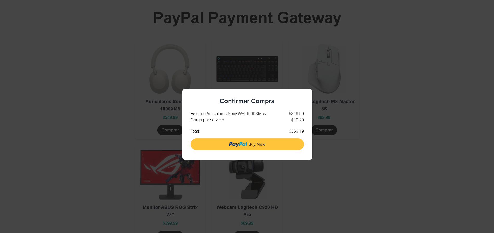

# PayPal Payment Gateway - Next.js

Una pasarela de pago integrada con **PayPal**, construida con **Next.js**.

## 🚀 Descripción

Este proyecto es una integración básica de PayPal en una aplicación Next.js. Permite realizar pagos mediante PayPal fácilmente. Solo necesitas proporcionar tu **Client ID** de PayPal.

## 🧰 Tecnologías utilizadas

- [Next.js](https://nextjs.org/)
- [PayPal JavaScript SDK](https://developer.paypal.com/sdk/js/)

## 🛠️ Instalación

1. Clona el repositorio:

```bash
git clone https://github.com/Jonvtvn/paypal-payment-gateway-nextjs.git
```
```bash
cd paypal-payment-gateway-nextjs
```

2. Instala las dependencias:
```bash
npm install
```
3. Crea un archivo .env.local y agrega tu Client ID de PayPal:
```bash
CLIENT_ID=TU_CLIENT_ID_DE_PAYPAL
```
   
4. Inicia el servidor de desarrollo:
```bash
npm run dev
```

## 👀 Vista previa


